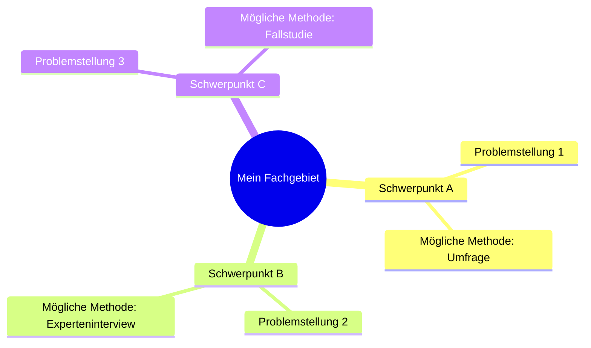

# 🧠 Mindmap & Themenideen

Nutze diese Vorlage, um deine Interessen, Vorerfahrungen und Themenideen mit der KI zu sammeln.

---

## 1. Meine Interessen & Vorerfahrungen
- **Fachrichtung**: *[z. B. Gesundheit & Soziales, Wirtschaft, Gestaltung]*
- **Stärken / Lieblingsfächer**: *[z. B. Pädagogik, Biologie, Informatik, Deutsch...]*
- **Erfahrungen aus Praktikum / Klasse 11**: *[z. B. Kita-Praktikum, Verwaltung, Agentur...]*
- **Themen, die mich persönlich bewegen**: *[z. B. Medienkonsum von Jugendlichen, Künstliche Intelligenz im Alltag, psychische Gesundheit, Marketingtrends...]*

---

## 2. Strukturierte Mindmap (Themenbaum)

---

## 3. Drei konkrete Themenvorschläge für den Fachlehrer

### Vorschlag 1:
- **Arbeitstitel**: *[Titel]*
- **Hauptfach & Bezugsfach**: *[z. B. Pädagogik + Biologie]*
- **Leitfrage / These**: *[Frage]*
- **Eigenanteil**: *[z. B. Fragebogen an 30 Personen]*

### Vorschlag 2:
- **Arbeitstitel**: *[Titel]*
- **Hauptfach & Bezugsfach**: *[Fächer]*
- **Leitfrage / These**: *[Frage]*
- **Eigenanteil**: *[z. B. Experteninterview mit 2 Fachkräften]*

### Vorschlag 3:
- **Arbeitstitel**: *[Titel]*
- **Hauptfach & Bezugsfach**: *[Fächer]*
- **Leitfrage / These**: *[Frage]*
- **Eigenanteil**: *[z. B. Datenvergleich / Fallanalyse]*
