# 🎤 Präsentationskonzept für das Verteidigungsgespräch (Kolloquium)

> **Rahmen**: 30 Minuten Gesamtdauer vor 2 Fachlehrern (**50 % der Gesamtnote!**).  
> **Aufteilung**: 15 Minuten Präsentation (Vortrag) + 15 Minuten Fachgespräch / Diskussion.  
> **Technik**: Eigenes Gerät über HDMI an die digitale Tafel (keine USB-Sticks!).

---

## ⏱️ Zeitplan für den 15-minütigen Vortrag

```mermaid
gantt
    title 15-Minuten-Vortrag
    dateFormat  m
    axisFormat %M Min
    section Einleitung (2-3 Min)
    Begrüßung, Thema, Fragestellung :0, 3
    section Hauptteil (9-10 Min)
    Theorie & Definitionen :3, 6
    Eigenanteil & Methoden :6, 9
    Ergebnisse & Erkenntnisse :9, 12
    section Schluss (2-3 Min)
    Fazit, Beantwortung Leitfrage, Ausblick :12, 15
```

---

## Folienübersicht (ca. 8 bis 10 Folien):

- **Folie 1**: Titelfolie (Thema, Name, Fächer, IBB Schule Dresden)
- **Folie 2**: Problemaufriss & Forschungsfrage (Warum ist das Thema wichtig?)
- **Folie 3**: Zielsetzung & methodischer Ansatz
- **Folie 4**: Theoretischer Rahmen (Zentrale Begriffe & Erkenntnisse)
- **Folie 5**: Praktischer Eigenanteil (Umfrage / Interview / Experiment)
- **Folie 6**: Wichtigste Ergebnisse & Diagramme
- **Folie 7**: Diskussion & Reflexion (Was bedeuten die Ergebnisse?)
- **Folie 8**: Fazit & Beantwortung der Ausgangsfrage
- **Folie 9**: Ausblick für die Praxis
- **Folie 10**: Quellen & Danksagung / Fragerunde eröffnen
